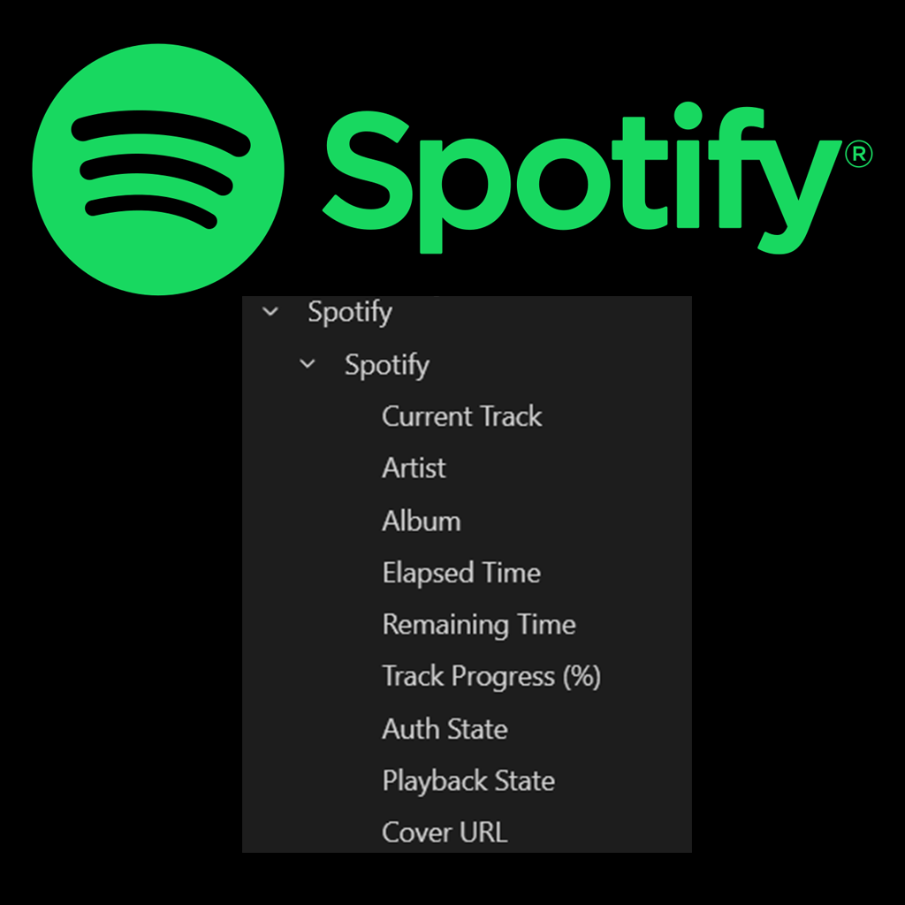

# SpotifyPlugin for InfoPanel

A plugin for [InfoPanel](https://github.com/habibrehmansg/infopanel) that displays real-time Spotify playback information — track name, artist, album, cover art, elapsed/remaining time, and progress percentage.



## Features

- Real-time track details: title, artist, album, cover art URL, elapsed/remaining time, and progress percentage
- Smart pause handling — track info stays visible when paused
- Customizable display messages for idle and paused states
- Configurable title truncation length
- Automatic background token refresh — authorize once and forget
- Built-in rate limiting to stay within Spotify API limits

---

## Quick Start

### 1. Create a Spotify App

You need a free Spotify Developer account to use this plugin.

1. Go to the [Spotify Developer Dashboard](https://developer.spotify.com/dashboard/) and log in.
2. Click **Create App**.
3. Fill in a name (e.g., `InfoPanel Spotify`) and description.
4. Set the **Redirect URI** to:
   ```
   http://127.0.0.1:5543/callback
   ```
5. Save the app, then copy your **Client ID** — you'll need it in step 3.

### 2. Install the Plugin

1. Download the latest release ZIP from the [Releases page](https://github.com/F3NN3X/InfoPanel.Spotify/releases).
2. Open InfoPanel and go to the **Plugins** page.
3. Click **Import Plugin Archive** and select the downloaded ZIP.

### 3. Configure

1. On the Plugins page, click **Open Plugins Folder**.
2. Close InfoPanel.
3. Open `InfoPanel.Spotify.dll.ini` in a text editor.
4. Replace `<your-spotify-client-id>` with the Client ID from step 1.
5. Save the file.

### 4. Authorize

1. Restart InfoPanel.
2. Click **"Authorize with Spotify"** in the plugin settings.
3. A browser window will open — log in and grant access.
4. Done! The plugin will start displaying your Spotify playback info.

---

## Configuration

Edit `InfoPanel.Spotify.dll.ini` in the plugin folder to customize the plugin.

```ini
[Spotify Plugin]
ClientID = <your-spotify-client-id>
MaxDisplayLength = 20
CallbackPort = 5543
NoTrackMessage = No music playing
PausedMessage =
NoTrackArtistMessage = -
ForceInvalidGrant = false
```

### Options

| Setting | Default | Description |
|---------|---------|-------------|
| `ClientID` | *(required)* | Your Spotify app Client ID from the [Developer Dashboard](https://developer.spotify.com/dashboard/). |
| `MaxDisplayLength` | `20` | Max characters for track/artist/album names. Longer text is truncated with `...`. |
| `CallbackPort` | `5543` | Local port for the OAuth callback server. Change this if port 5543 is already in use. Must also match the Redirect URI in your Spotify app settings. |
| `NoTrackMessage` | `No music playing` | Message shown when Spotify has no track loaded. |
| `PausedMessage` | *(empty)* | Message shown when paused. Leave empty to keep showing actual track info. |
| `NoTrackArtistMessage` | `-` | Artist field text when no track is playing or when a custom paused message is active. |
| `ForceInvalidGrant` | `false` | Debug builds only. Forces a token refresh failure for testing. |

### Examples

**Keep track info visible when paused** (default):
```ini
[Spotify Plugin]
ClientID = abc123xyz
MaxDisplayLength = 25
```

**Custom idle and paused messages:**
```ini
[Spotify Plugin]
ClientID = abc123xyz
MaxDisplayLength = 30
NoTrackMessage = ♪ Spotify idle
PausedMessage = ⏸ Music paused
NoTrackArtistMessage = No artist
```

---

## Troubleshooting

<details>
<summary><strong>"Spotify client not initialized"</strong></summary>

The plugin hasn't connected to Spotify yet.

**Fix:** Click **"Authorize with Spotify"** in the plugin settings and follow the browser prompt. If it persists, check that your `ClientID` is set correctly in the `.ini` file.
</details>

<details>
<summary><strong>"Reauthorize Required"</strong></summary>

The refresh token has expired or been revoked by Spotify.

**Fix:** Click **"Authorize with Spotify"** again. If it persists, delete `spotifyrefresh.tmp` from the plugin folder and reauthorize.
</details>

<details>
<summary><strong>"Error updating Spotify info"</strong></summary>

A network issue, rate limit, or token problem prevented the plugin from fetching track data.

**Fix:** Check your internet connection and wait 10–20 seconds for automatic retry. If it persists, restart InfoPanel or click **"Authorize with Spotify"**.
</details>

<details>
<summary><strong>"Rate limit exceeded"</strong></summary>

Too many API requests in a short time.

**Fix:** Wait about a minute — the plugin retries automatically. If it keeps happening, close other apps using the Spotify API.
</details>

<details>
<summary><strong>"Spotify ClientID is not set or is invalid"</strong></summary>

The `ClientID` in your `.ini` file is missing or incorrect.

**Fix:** Open `InfoPanel.Spotify.dll.ini`, set your Client ID under `[Spotify Plugin]`, save, and restart InfoPanel.
</details>

<details>
<summary><strong>Authorization hangs or never completes</strong></summary>

The OAuth callback server could not start, usually because the port is in use.

**Fix:** Change `CallbackPort` in `InfoPanel.Spotify.dll.ini` to a different port (e.g., `5544`). Then update the **Redirect URI** in your [Spotify Developer Dashboard](https://developer.spotify.com/dashboard/) to match (e.g., `http://127.0.0.1:5544/callback`). Restart InfoPanel and try again.
</details>

<details>
<summary><strong>General tips</strong></summary>

- **Restart InfoPanel** to fix most temporary issues.
- **Delete `spotifyrefresh.tmp`** and reauthorize if token-related errors persist.
- **Check your Spotify account** at [spotify.com/account/apps](https://www.spotify.com/account/apps) to verify the app still has permission.
- For persistent issues, open a [GitHub Issue](https://github.com/F3NN3X/InfoPanel.Spotify/issues) with the error message and what you've tried.
</details>

---

## Exposed Data

The plugin provides the following data points to InfoPanel:

| Type | ID | Name | Values |
|------|----|------|--------|
| Text | `current-track` | Current Track | Track name or status message |
| Text | `artist` | Artist | Artist name |
| Text | `album` | Album | Album name |
| Text | `elapsed-time` | Elapsed Time | `mm:ss` format |
| Text | `remaining-time` | Remaining Time | `mm:ss` format |
| Text | `cover-art` | Cover URL | Spotify album art URL |
| Sensor | `track-progress` | Track Progress (%) | `0.0` – `100.0` |
| Sensor | `auth-state` | Auth State | `0` = Not Authenticated, `1` = Authenticating, `2` = Authenticated, `3` = Error |
| Sensor | `playback-state` | Playback State | `0` = Not Playing, `1` = Paused, `2` = Playing |

---

## Development

### Requirements

- .NET 8.0 SDK
- [InfoPanel](https://github.com/habibrehmansg/infopanel) repository cloned locally (the project references `InfoPanel.Plugins.csproj` at an absolute path)
- Spotify API Client ID

### Build

```bash
# Debug build
dotnet build -c Debug

# Release build (outputs to bin/Release/net8.0-windows/InfoPanel.Spotify-v{VERSION}/InfoPanel.Spotify/)
dotnet build -c Release
```

### Contributing

Found a bug or have a feature idea? Open an [issue](https://github.com/F3NN3X/InfoPanel.Spotify/issues) or submit a [pull request](https://github.com/F3NN3X/InfoPanel.Spotify/pulls)!
